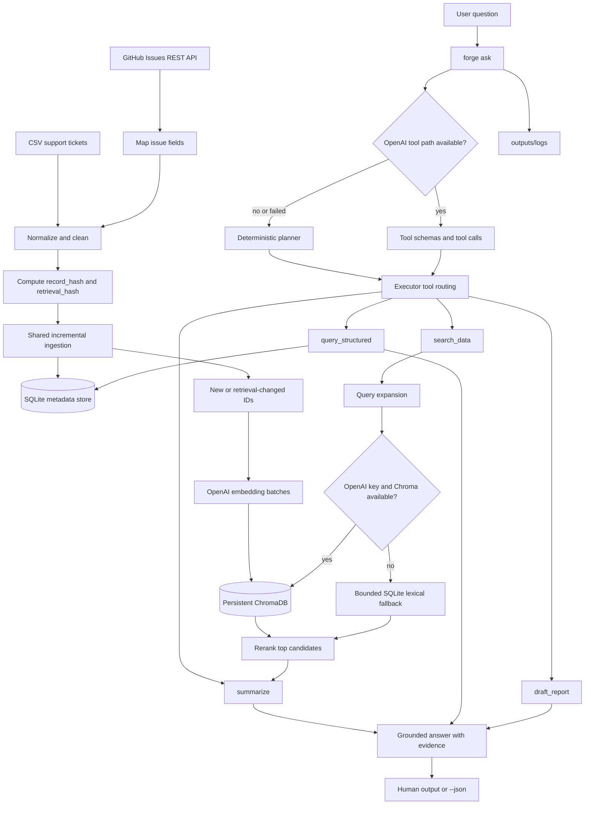

# Forge


Forge is a Python CLI for ingesting support tickets and GitHub Issues, maintaining an incremental SQLite metadata store, building a ChromaDB vector index, and answering support questions with structured analytics or grounded retrieval.

It is designed for investigations such as:

```text
What are the top complaint categories?
How many payment issues occurred?
Summarize login issues.
Why are users unhappy?
```

Forge is a portfolio-scale implementation of a retrieval-augmented support investigation system. It is not a hosted service, a frontend, a general-purpose web search engine, or a customer-management system.

> **Current status:** active development. The repository contains no CI workflow and no `LICENSE` file. The test count above reflects the local suite currently present in `tests/`.

## Overview

Support data is useful only when it can be searched, counted, and explained consistently. Forge combines two complementary paths:

- **Structured analytics:** SQLite answers exact counts, trends, filters, and group-by questions.
- **Semantic investigation:** ChromaDB retrieves related tickets using OpenAI embeddings, with a bounded lexical SQLite fallback when semantic retrieval is unavailable.

Both paths share the same normalized ticket schema. A lightweight planner chooses a tool chain, the executor runs that chain, and the CLI presents either human-readable output or JSON.

Forge is intended for engineers and analysts who want a local, inspectable support-data workflow with:

- repeatable ingestion from CSV or GitHub Issues;
- incremental refreshes that avoid unnecessary embeddings;
- exact metadata analytics alongside semantic search;
- evidence-bearing answers with ticket IDs;
- explicit refusal when the indexed data cannot support an answer; and
- a small evaluation harness for routing and retrieval experiments.

## Demo

### Install and configure

```bash
git clone <your-fork-or-checkout>
cd forge-Ai

python3.11 -m venv .venv
source .venv/bin/activate
python -m pip install -r requirements.txt

cp .env.example .env
# Edit .env and set OPENAI_API_KEY.
```

### Ingest a CSV dataset

```bash
python -m forge.cli ingest \
  --source /path/to/customer_support_tickets.csv
```

The command writes normalized metadata to `data/forge.db`. New records and records whose retrieval content changed are marked as embedding candidates.

### Embed records from the current ingestion run

```bash
python -m forge.cli ingest \
  --source /path/to/customer_support_tickets.csv \
  --embed
```

With `--embed`, Forge embeds only records inserted or retrieval-content-updated by that ingestion run. It does not automatically embed the entire pending backlog.

### Ask a question

```bash
python -m forge.cli ask "Summarize login issues"
```

Typical human-readable output:

```text
Question
Summarize login issues

Summary
Recurring pattern: Login Issue was the dominant category in 5 of 5 retrieved tickets.
Likely resolution: Credentials reset (3 tickets).
Important observations: High was the most common priority and Closed was the most common status.

Evidence
• Ticket 113
• Ticket 123

Confidence
0.86
```

Use `--json` when another program needs the machine-readable response:

```bash
python -m forge.cli ask "How many payment issues occurred?" --json
```

### Inspect pipeline health

```bash
python -m forge.cli status
```

### Ingest GitHub Issues

```bash
python -m forge.cli ingest \
  --source github \
  --repo microsoft/vscode \
  --embed
```

Public repositories work without `GITHUB_TOKEN`. A token is optional and can increase rate limits or authorize access to private repositories.

### Screenshots and GIFs

The repository currently contains no checked-in screenshots or demo GIF. Suggested documentation assets:

```text
<!-- Screenshot placeholder: forge status output -->
<!-- GIF placeholder: CSV ingestion followed by a grounded ask -->
```

## Features

### Incremental ingestion

Forge computes two SHA-256 hashes for each normalized record:

- `record_hash` covers every normalized ticket field.
- `retrieval_hash` covers only the fields used to build the retrieval document: issue description, resolution notes, category, product, and priority.

This distinction lets Forge update metadata without re-embedding unchanged retrieval text. New records and retrieval-content changes become embedding candidates; unchanged records are skipped; metadata-only changes preserve the previous embedding status.

### CSV ingestion

`forge.pipeline.ingest.ingest_csv` reads a CSV with the existing ticket schema, normalizes text and numeric fields, validates `ticket_id`, computes hashes, and upserts rows into SQLite. Invalid rows are counted and up to 100 sample errors are written to the ingestion log.

### GitHub Issues ingestion

`forge.pipeline.github` calls the GitHub REST API, follows pagination, ignores pull requests, maps issues into the same ticket schema, and delegates persistence to the shared `ingest_records` path. GitHub is therefore another source adapter, not a second storage or embedding pipeline.

### SQLite analytics

The allowlisted structured-query layer supports:

- counts;
- group-by aggregations;
- monthly trends based on `ticket_created_date`; and
- filtered ticket results.

Identifiers are allowlisted and values are parameter-bound. Structured results expose safe ticket fields and omit customer email and other private identity fields.

### ChromaDB retrieval

When embeddings are available, Forge stores retrieval documents and vectors in the persistent ChromaDB collection `forge_tickets`. Retrieval asks ChromaDB for the top `k` vectors and then reads the corresponding public ticket metadata from SQLite.

### OpenAI embeddings

The default embedding model is `text-embedding-3-large`, configurable through `FORGE_EMBED_MODEL`. Embedding requests are batched, retried up to four attempts, written to ChromaDB, and followed by an SQLite status update.

### Planner and tool routing

Forge has a deterministic planner for local, inspectable execution and an optional OpenAI tool-calling path. The deterministic planner routes metadata questions to `query_structured`, semantic questions to `search_data`, qualitative summaries through `search_data` followed by `summarize`, and reports through a multi-step chain.

Top-N routing is intent-aware: `top 5 labels` is structured metadata, while `top 5 authentication issues`, `top 5 login problems`, and `top 5 browser crashes` are semantic support questions.

### Query normalization

Before retrieval, Forge preserves the original question and appends configurable synonym terms. For example, an authentication query is expanded with login, sign-in, credential, and password vocabulary. Similar mappings cover payment/billing/refund, performance/slow/lag/freeze, synchronization, crashes/failures, and browser names.

### Evidence-aware summaries

The deterministic summarizer prioritizes evidence text and structured metadata in this order:

1. category signals inferred from issue description and resolution notes;
2. the most common resolution;
3. the most common priority; and
4. the most common status.

It reports ties explicitly and uses the metadata category only when the evidence text does not provide a stronger category signal. It does not call an LLM to concatenate arbitrary ticket descriptions.

### Hallucination guard

Unsupported-domain questions are rejected before retrieval when they contain no supported support-ticket vocabulary. Empty or insufficient retrieval produces `No supporting evidence found in indexed data.` rather than an invented answer. OpenAI tool responses are also checked for evidence before being returned.

### Confidence scoring

The response includes a confidence value:

- exact SQL filters: `1.00`;
- SQL aggregations and trends: `0.95`;
- supported RAG evidence: calibrated into weak-to-strong evidence bands;
- insufficient or unsupported evidence: `0.00`.

Confidence is a retrieval/evidence signal, not a statistical probability or a guarantee of factual correctness.

### Structured logs and reports

Ingestion writes JSON logs to `outputs/logs/`. Ask commands write JSON Lines agent logs containing the question, selected tools, tool sequence, retrieved ticket IDs, latency, token usage, final answer, and deterministic plan when available. Weekly reports are written as Markdown to `outputs/reports/`.

### Evaluation harness

`eval/dataset.json` contains 50 cases spanning structured analytics, semantic search, summaries, anomaly questions, and unsupported questions. The harness evaluates planner routing, retrieval at five, structured-query matching, grounded responses, hallucination classification, and latency.

The evaluation runner processes cases one at a time, keeps only bounded top-k retrieval evidence, reuses lazy OpenAI/Chroma resources, and closes its SQLite connection. It is a local benchmark, not a CI quality gate.

## Architecture



### What each arrow means

- CSV and GitHub inputs enter different source adapters, then converge at normalization.
- Normalization makes both sources fit the same SQLite schema and retrieval-document format.
- Hashing decides whether a row is new, unchanged, metadata-only changed, or retrieval-content changed.
- Only new or retrieval-changed IDs enter the embedding path.
- SQLite remains the authoritative metadata and analytics store; ChromaDB stores searchable vectors and retrieval documents.
- `forge ask` first attempts the OpenAI tool-calling path when configured. If that path is unavailable or raises an exception, the deterministic planner is used.
- The executor sends exact metadata questions to SQLite and semantic questions through query expansion, vector retrieval, or lexical fallback.
- Retrieved evidence is reranked and passed to the deterministic summarizer when a summary is requested.
- The final response is rendered for a human terminal by default, or as JSON with `--json`.
- Agent execution metadata is appended to `outputs/logs/`.

## Folder structure

```text
forge-Ai/
├── forge/
│   ├── agent/
│   │   ├── executor.py       # ask orchestration, deterministic execution, reports, logs
│   │   ├── planner.py        # plan objects, tool schemas, intent routing, OpenAI tool loop
│   │   └── tools.py          # search, summary, structured/anomaly helper tools
│   ├── analytics/
│   │   ├── queries.py        # allowlisted SQLite operations
│   │   └── schema.py         # tickets/ingest_runs schema and light migration
│   ├── pipeline/
│   │   ├── clean.py          # normalization, retrieval documents, two hashes
│   │   ├── github.py         # GitHub REST adapter and issue mapping
│   │   ├── ingest.py         # shared CSV/record incremental ingestion
│   │   └── profile.py        # CSV profile generation
│   ├── rag/
│   │   ├── embed.py          # OpenAI embedding batches and targeted embedding
│   │   ├── rerank.py         # deterministic lexical reranking
│   │   ├── retrieve.py       # Chroma retrieval and SQLite lexical fallback
│   │   └── vectorstore.py    # small ChromaDB persistence wrapper
│   ├── search/
│   │   └── query_normalizer.py # configurable additive synonym expansion
│   ├── cli.py                # Typer CLI and argparse fallback renderer
│   └── config.py             # .env loading, paths, limits, key validation
├── eval/
│   ├── dataset.json          # active 50-case evaluation dataset
│   ├── evaluator.py          # bounded case-by-case evaluation harness
│   ├── metrics.py            # pure metric functions
│   ├── run_eval.py           # CLI entry point and terminal report
│   ├── eval_set.json         # small legacy/reference query fixture
│   └── structured_eval_set.json # small legacy/reference structured fixture
├── tests/                    # unit tests with local fixtures and mocked HTTP/OpenAI paths
├── data/                     # runtime SQLite and ChromaDB data; ignored by Git
├── outputs/                  # runtime logs and reports; ignored by Git
├── .env.example              # configuration template
├── pyproject.toml            # package metadata and forge console script
├── requirements.txt          # runtime dependencies
└── README.md
```

Runtime directories and generated files are intentionally ignored by `.gitignore`. The repository also contains local Python cache files in some checkouts; they are not application modules.

## End-to-end workflow

Consider:

```bash
python -m forge.cli ask "Why are login failures increasing?"
```

The current execution path is:

1. `forge.config` loads the project-root `.env` when `python-dotenv` is installed and resolves database, Chroma, output, model, and embedding-limit settings.
2. The CLI opens SQLite, initializes the schema if needed, and requires `OPENAI_API_KEY` for `ask`.
3. Forge attempts the OpenAI chat-completions tool loop using the configured model (`gpt-4o` by default).
4. If the OpenAI path is unavailable or fails, `plan_question` creates a deterministic `search_data` plan for this qualitative question.
5. `search_data` preserves the original question, expands login-related vocabulary, and checks that the query belongs to the supported ticket domain.
6. Retrieval first attempts OpenAI embeddings plus ChromaDB. If semantic retrieval is unavailable, it searches selected SQLite text fields with bounded lexical conditions.
7. Candidates are reranked and reduced to the requested `k` tickets, normally five.
8. The response carries ticket IDs, confidence, evidence status, and the selected tool sequence.
9. The CLI prints a human-readable answer by default or the full response object with `--json`.
10. `_log_agent_run` appends timing, sources, token usage, and answer details to the daily agent JSONL log.

The phrase “increasing” does not currently cause a time-series trend query by itself. Structured routing requires terms such as `trend`, `over time`, `monthly`, or `by month`; otherwise this example is treated as a semantic support question.

## Retrieval pipeline

### 1. Retrieval document construction

`retrieval_document` creates a text document from:

```text
issue_description
resolution_notes
category
product
priority
```

Customer name, email, and phone-like values are redacted from that document. These fields also define `retrieval_hash`, so changes to them trigger re-embedding.

### 2. Query expansion

The normalizer appends terms without replacing the user query. For example:

```text
authentication problems
→ authentication problems login login issue authentication sign in signin credential password
```

The mapping is a Python constant in `forge/search/query_normalizer.py`, making additions straightforward and reviewable.

### 3. Semantic search

If `OPENAI_API_KEY` is present, Forge creates a query embedding with `FORGE_EMBED_MODEL` and asks the `forge_tickets` ChromaDB collection for the top candidates. SQLite is then used to fetch the safe public fields for the returned IDs.

### 4. Lexical fallback

If the key is absent or semantic retrieval raises an exception, Forge tokenizes the expanded query, removes a small stopword list, and searches `issue_description`, `resolution_notes`, `category`, `product`, and `priority` with SQLite `LIKE` predicates. The fallback bounds the raw result set at 500 rows before reranking.

### 5. Reranking and evidence selection

The local reranker counts query-word occurrences in each candidate and returns the requested `k` items. Retrieval distance or lexical score is converted into a confidence signal. Results below the minimum evidence threshold are discarded.

### 6. Summarization

The summarizer works only from the retrieved ticket dictionaries. It reports a recurring category, likely resolution, common priority, common status, and repeated supporting context when available. It does not invent facts from outside the retrieved evidence.

## Analytics pipeline

`query_structured` accepts one of four allowlisted operations:

| Operation | Behavior |
| --- | --- |
| `count` | Exact `COUNT(*)`, optionally filtered or date-bounded. |
| `group_by` | Counts values of an allowlisted field, ordered by count and value. |
| `trend_over_time` | Groups by the `YYYY-MM` prefix of `ticket_created_date`. |
| `filter` | Returns safe ticket fields, ordered by creation date, with a bounded limit. |

The planner selects structured SQL for metadata and aggregation intent:

```text
top 5 labels                 → query_structured, group_by
top complaint categories     → query_structured, group_by category
how many payment issues      → query_structured, count, category filter
show monthly ticket trends   → query_structured, trend_over_time
top 5 authentication issues  → search_data
```

Explicit `top N` values are passed through the plan and parameterized in SQL. The SQL layer clamps result limits to the range 1–1000.

## Incremental ingestion

### Freshness decision

For each normalized record:

```text
new record
  → insert with embedding_status = pending
  → add ticket ID to current-run embedding candidates

record_hash unchanged
  → skip the row
  → no embedding candidate

record_hash changed, retrieval_hash unchanged
  → update SQLite metadata
  → preserve embedding status
  → no embedding candidate

retrieval_hash changed
  → update SQLite metadata
  → mark pending
  → add ticket ID to current-run embedding candidates
```

The ingestion function returns `embedding_ticket_ids`. The CLI passes exactly those IDs to `embed_ticket_ids` when `--embed` is specified. `embed_pending` remains available as a Python function for intentional backlog processing, but it is not exposed as a separate CLI subcommand.

### Embedding lifecycle

1. The selected SQLite rows are loaded in batches.
2. Retrieval documents are built and sent to OpenAI.
3. IDs, documents, embeddings, and small Chroma metadata are upserted.
4. SQLite rows are marked `embedding_status='embedded'` and committed.
5. Progress is printed to stderr.

`FORGE_EMBED_LIMIT` is read by the status renderer to describe an intentional development limit. It does not itself slice the current embedding candidate list; the current project data and ingest workflow use it as status context.

## GitHub Issues ingestion

Forge uses the GitHub REST API endpoint for all issues in a repository with `state=all` and `per_page=100`. It follows the API `Link` header and also advances pages when a full page is returned without a link. Pull requests are ignored because GitHub represents them in the issues endpoint with a `pull_request` field.

### Field mapping

| GitHub value | Forge field |
| --- | --- |
| issue ID, falling back to issue number | `ticket_id` |
| first label, or `Uncategorized` | `category` |
| title plus body | `issue_description` |
| open/closed state plus latest non-empty closing comment | `resolution_notes` |
| recognized priority labels | `priority` |
| issue state | `status` |
| constant | `channel = GitHub` |
| repository name | `product` |
| constant | `region = Unknown` |
| `created_at` date | `ticket_created_date` |
| `updated_at` timestamp | `updated_date` |
| `closed_at` date for closed issues | `ticket_resolved_date` |

Priority labels containing `urgent`, `critical`, or `p0` map to `Urgent`; `high` or `p1` map to `High`; `low` or `p3` map to `Low`; all other cases map to `Medium`.

### Errors

Invalid repository syntax, not-found/private repositories, authentication failures, rate limits, malformed responses, and network errors are converted into stable error results for the CLI. Public repositories do not require `GITHUB_TOKEN`.

## Hallucination prevention

Forge is grounded in the indexed dataset, not in general world knowledge. For example:

```bash
python -m forge.cli ask "Who is the CEO?"
```

The query does not contain supported ticket-domain vocabulary, so retrieval returns no tickets and the answer is:

```text
No supporting evidence found in indexed data.
```

This guard has a defined scope. It prevents unsupported answers from the indexed support workflow; it is not a general safety filter, PII classifier, or external fact-checking service.

## Agent orchestration

The tool set declared in `forge.agent.planner` is:

| Tool | Intended use |
| --- | --- |
| `search_data` | Semantic lookup, explanations, and related tickets. |
| `query_structured` | Counts, aggregations, trends, group-bys, and allowlisted filters. |
| `summarize` | Summarization after `search_data` provides tickets. |
| `draft_report` | Drafting after analytics and evidence preparation. |
| `flag_anomaly` | Helper for selecting the highest-volume category in the current implementation. |

The OpenAI path exposes these schemas to chat completions and allows up to five tool-call rounds. The deterministic path is inspectable and testable without making a chat completion, but `forge ask` still requires an API key before either path is attempted.

### Current anomaly scope

The evaluation dataset contains anomaly questions and the tool schema contains `flag_anomaly`. However, the current deterministic `plan_question` implementation does not yet classify anomaly wording into that tool, and the helper currently reports the highest-volume category rather than a time-series spike detector. This README intentionally does not describe anomaly detection as complete functionality.

## Evaluation

Run the active 50-case evaluation set:

```bash
python eval/run_eval.py --db data/forge.db
```

Use a different dataset or machine-readable aggregate output:

```bash
python eval/run_eval.py \
  --db data/forge.db \
  --dataset eval/dataset.json \
  --json
```

The terminal report contains:

| Metric | Meaning in the evaluation harness |
| --- | --- |
| Recall@5 | Fraction of gold-relevant tickets retrieved in the first five results. |
| Precision@5 | The pure metric function defines this as the fraction of the first five retrieved results classified as relevant; the current case harness supplies its top-k gold hits as the relevant set, so treat the aggregate as a baseline until gold-set handling is strengthened. |
| Planner Accuracy | Fraction of cases whose deterministic tool chain exactly matches `expected_tools`. |
| Structured Query Accuracy | Fraction of cases whose first structured step matches the expected operation and field. |
| Grounded Responses | Fraction of cases not classified as hallucinations. |
| Hallucination Rate | Fraction of cases with unsupported claims, missing expected refusal, or evaluation errors. |
| Latency | Average case execution time in milliseconds. |

The active dataset contains 15 structured, 10 semantic, 10 summary, 5 anomaly, and 10 unsupported cases. `eval/eval_set.json` and `eval/structured_eval_set.json` are small legacy/reference fixtures; `run_eval.py` uses `eval/dataset.json` by default.

The evaluator is deliberately bounded: it processes one case at a time, retrieves only top-k evidence, avoids loading the full Chroma collection, reuses shared lazy resources, and closes the database connection in `run_eval.py`.

## Installation

### Requirements

- Python 3.11 or newer.
- An OpenAI API key for `ask` and embedding operations.
- Network access to the OpenAI API when using embeddings or the OpenAI tool path.
- Network access to the GitHub REST API for GitHub ingestion.

### Install from the repository

```bash
python3.11 -m venv .venv
source .venv/bin/activate
python -m pip install --upgrade pip
python -m pip install -r requirements.txt
```

The package metadata in `pyproject.toml` also defines the console script:

```bash
forge --help
```

The module form remains supported:

```bash
python -m forge.cli --help
```

## Configuration

Create a local `.env` from the committed template:

```bash
cp .env.example .env
```

Never commit `.env`. It is ignored by `.gitignore`.

| Variable | Required | Default | Purpose |
| --- | --- | --- | --- |
| `OPENAI_API_KEY` | Yes for `ask` and embedding | none | OpenAI chat and embedding authentication. |
| `GITHUB_TOKEN` | No | none | Optional GitHub authentication for private repositories or higher rate limits. |
| `FORGE_DB` | No | `data/forge.db` | SQLite database path. |
| `FORGE_CHROMA` | No | `data/chroma` | Persistent ChromaDB path. |
| `FORGE_OUTPUTS` | No | `outputs` | Log and report root directory. |
| `FORGE_EMBED_LIMIT` | No | `0` | Status context for an intentional development embedding limit. |
| `FORGE_MODEL` | No | `gpt-4o` | OpenAI chat-completions model. |
| `FORGE_EMBED_MODEL` | No | `text-embedding-3-large` | OpenAI embedding model. |

Forge loads `.env` from the project root through `python-dotenv` when `forge.config` is imported. If `OPENAI_API_KEY` is missing, commands that require OpenAI print setup instructions instead of a Python traceback.

## CLI reference

### `profile`

Profile a CSV without ingesting it:

```bash
python -m forge.cli profile \
  --source /path/to/customer_support_tickets.csv \
  --output outputs/profile.json
```

The profile counts rows, columns, duplicate ticket IDs, missing fields, unique text values, date range, and the known PII fields. This command is implemented for CSV input.

### `ingest`

Ingest a CSV:

```bash
python -m forge.cli ingest \
  --source /path/to/customer_support_tickets.csv \
  --db data/forge.db
```

Ingest GitHub Issues:

```bash
python -m forge.cli ingest \
  --source github \
  --repo owner/repository \
  --db data/forge.db
```

Add `--embed` to embed only current-run candidates. The command supports `--source github:owner/repository` internally as an alternate source string, although the documented form is `--source github --repo owner/repository`.

### `ask`

```bash
python -m forge.cli ask "Why are users unhappy?"
python -m forge.cli ask "What are the top complaint categories?" --json
```

Default output is for people. `--json` preserves machine-readable fields including `answer`, `evidence`, `source_ticket_ids`, `confidence`, `tool_calls`, and the plan when the deterministic path is used.

### `status`

```bash
python -m forge.cli status
python -m forge.cli status --json
```

The status screen reports SQLite, ChromaDB, total records, embedded records, pending records, embedding mode, last ingestion time, embedding failures, and freshness. A pending count can be intentional when a development embedding limit is configured.

### `tools`

```bash
python -m forge.cli tools
```

Print the registered tool names.

### `run report`

Generate a weekly Markdown summary:

```bash
python -m forge.cli run report \
  --type weekly-summary \
  --start 2024-12-25 \
  --end 2024-12-31 \
  --db data/forge.db
```

Without explicit dates, Forge derives a seven-day range ending at the latest `ticket_created_date` in SQLite. The report contains ticket count, top five categories, priority distribution, SLA-breach distribution, and a note that customer names/emails are excluded.

## Data model and storage

### SQLite

The `tickets` table stores the normalized source fields plus:

- `record_hash`;
- `retrieval_hash`;
- `embedding_status`; and
- `ingested_at`.

The `ingest_runs` table stores source, timestamps, loaded/new/changed/skipped counts, embedding candidates, and error counts. `init_db` creates indexes for creation date, category, and retrieval hash and adds `updated_date` to older databases when needed.

### ChromaDB

`ChromaStore` opens a persistent ChromaDB client and the `forge_tickets` collection. Each upsert contains:

- `ticket_id` as the Chroma ID;
- the redacted retrieval document;
- the OpenAI embedding; and
- category, product, and priority metadata.

SQLite remains the source of truth for returned ticket fields and exact analytics.

## Testing

Run the complete local suite:

```bash
python -m unittest discover -s tests -v
```

The tests cover:

- deterministic planner routing and top-N intent;
- human CLI rendering and status rendering;
- `.env`/OpenAI configuration errors;
- incremental CSV and GitHub ingestion;
- hash reuse and embedding scope;
- GitHub pagination, mapping, pull-request filtering, and error results;
- query expansion and evidence-aware summaries;
- SQLite validation and PII-safe structured fields; and
- evaluation metrics, dataset coverage, bounded answerer resources, and report formatting.

GitHub tests mock HTTP responses. They do not call the live GitHub API. Embedding tests use fake OpenAI/Chroma objects. Production ingestion does not use those fixtures.

## Technical decisions and trade-offs

### SQLite for metadata and analytics

SQLite is embedded, portable, transactional, and sufficient for exact counts and allowlisted filters over a local support dataset. The trade-off is that it is not a distributed analytics warehouse and does not provide a server-managed multi-user deployment model.

### ChromaDB for vectors

ChromaDB provides a local persistent vector collection with a small integration surface. Keeping it beside SQLite makes the storage boundary explicit: SQLite owns metadata; ChromaDB owns vector retrieval. The trade-off is another local storage engine and a dependency heavier than the lexical fallback.

### RAG instead of free-form generation

Support answers need evidence and ticket IDs. Retrieval limits the answer context to indexed tickets and enables a refusal when nothing supports the question. The trade-off is that answers are limited to the indexed data and can miss relevant tickets when embeddings, vocabulary, or source coverage are weak.

### Two hashes instead of one

A single freshness hash would force metadata-only edits to re-embed. Separating complete-record freshness from retrieval-content freshness reduces embedding cost while retaining metadata updates. The trade-off is that the retrieval field list must be maintained when retrieval-document construction changes.

### Deterministic planner plus optional OpenAI tools

The deterministic planner makes routing testable and provides a local fallback. OpenAI tool calling can handle more flexible multi-step orchestration when configured. The trade-off is two execution behaviors to test and the requirement for an OpenAI key before `ask` is attempted.

### Lightweight query expansion

A configurable synonym map improves recall without changing the embedding model, vector store, or ingestion format. The trade-off is broader queries and possible retrieval noise; mappings should be extended only with domain evidence and regression tests.

### No automatic deletion reconciliation

Ingestion upserts records received from a source but does not delete SQLite records that disappear from a later CSV or GitHub response. This avoids destructive synchronization by default, but it means a source removal is not represented automatically.

## Future improvements

These are intentionally scoped follow-ups, not current features:

- add explicit anomaly intent routing and a real time-series spike detector;
- correct and expand evaluation gold-set handling, then add a CI quality gate;
- add source-aware deletion or archival reconciliation with an explicit opt-in;
- reuse OpenAI and Chroma clients in the main retrieval path to reduce per-query initialization;
- add a committed license and continuous-integration workflow; and
- add larger-scale operational controls for rate limits, retries, and multi-user deployments.

## Contributing

1. Create a focused branch from the current project state.
2. Keep changes incremental and preserve the shared ingestion, SQLite, and Chroma boundaries.
3. Add or update tests for routing, ingestion, retrieval, or CLI behavior.
4. Run:

   ```bash
   python -m unittest discover -s tests -v
   git diff --check
   ```

5. Do not commit `.env`, API keys, SQLite databases, Chroma data, generated logs, reports, or profile output.
6. In a pull request, describe the behavior change, test evidence, and any data or cost trade-off.

## License

No `LICENSE` file is currently included in this repository. Add an explicit license before distributing Forge or accepting external contributions under defined terms.

## Acknowledgements

Forge uses and integrates with:

- Python and the Python standard library;
- SQLite;
- OpenAI embeddings and chat completions;
- ChromaDB;
- Typer;
- `python-dotenv`; and
- the GitHub REST API.

These dependencies are used as implementation components; Forge is not affiliated with their maintainers.
