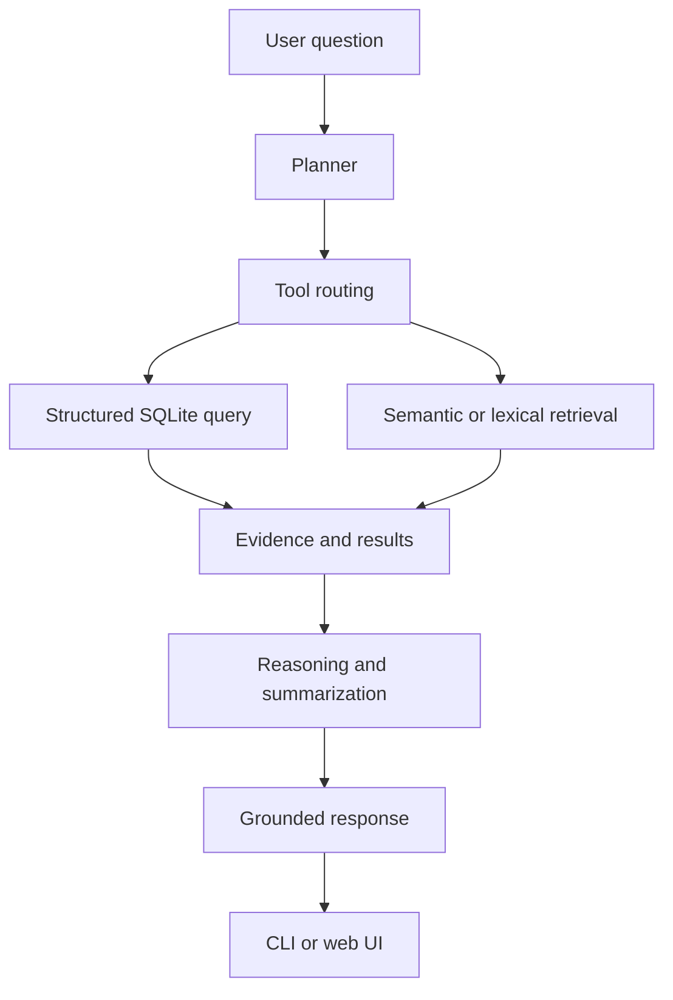
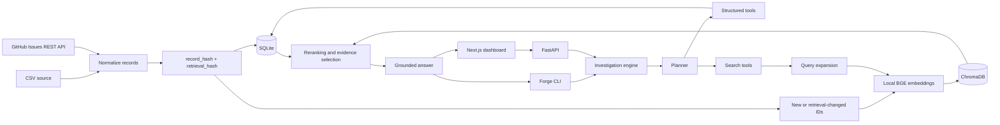

# Forge – AI Support Investigation Platform


Forge turns support tickets and GitHub Issues into searchable, explainable investigations. It combines exact SQLite analytics, local semantic retrieval, evidence-aware summaries, and an AI orchestration layer behind a CLI, FastAPI service, and modern web dashboard.

> Forge is designed for local, inspectable investigations. It answers from indexed support data and refuses to invent evidence when the data cannot support a claim.

## Contents

- [Project overview](#project-overview)
- [Key features](#key-features)
- [How Forge works](#how-forge-works)
- [Architecture](#architecture)
- [Folder structure](#folder-structure)
- [Technologies](#technologies)
- [Installation](#installation)
- [Environment variables](#environment-variables)
- [Running the project](#running-the-project)
- [Example workflow](#example-workflow)
- [Application screens](#application-screens)
- [AI pipeline](#ai-pipeline)
- [Explainability and grounding](#explainability-and-grounding)
- [CLI reference](#cli-reference)
- [HTTP API](#http-api)
- [Evaluation](#evaluation)
- [Testing](#testing)
- [Technical decisions](#technical-decisions)
- [Future improvements](#future-improvements)
- [Contributing](#contributing)
- [License](#license)

## Project overview

Customer-support data often contains the answer to an operational question, but finding it manually is slow. An analyst may need to search thousands of tickets, group categories, compare priorities, read resolutions, and then explain which records support the conclusion.

Forge makes that workflow queryable. A user can ask for an exact count, a category breakdown, or a semantic explanation using the same investigation system. The system chooses between structured SQL and retrieval based on the question, then returns the result with confidence, timings, and supporting ticket IDs.

Forge is different from a normal chatbot in three important ways:

1. It treats SQLite and ChromaDB as the source of investigation evidence.
2. It separates exact analytics from semantic search instead of using an LLM for every question.
3. It refuses unsupported questions instead of filling gaps with general-world knowledge.

Forge is useful for portfolio demonstrations, support-operations prototypes, data-engineering experiments, and engineers learning how a grounded RAG system is assembled.

## Key features

### Semantic investigation

Natural-language questions such as “Summarize login issues” are expanded with configurable synonyms, embedded locally with a BGE Sentence Transformers model, and matched against ChromaDB vectors. The original user question is preserved; expansion is used only for retrieval.

### SQL-based investigation

Questions about counts, groupings, trends, filters, and distributions use allowlisted SQLite queries. Examples include “How many payment issues occurred?” and “Show the top 5 labels.” SQL keeps exact metadata questions deterministic and efficient.

### Evidence-backed answers

Investigation responses include the answer, confidence, retrieval strategy, and source ticket IDs. Semantic results are hydrated from SQLite so the final response uses the public ticket fields associated with the retrieved vectors.

### Confidence scoring

Confidence is an evidence signal between `0.0` and `1.0`. Exact SQL lookups are treated as highly confident, SQL aggregations receive a high score, strong semantic evidence receives a calibrated score, and missing evidence produces zero confidence. It is not a statistical probability.

### Retrieval strategy

The response identifies whether evidence came from semantic Chroma retrieval, structured SQLite analysis, or the bounded SQLite lexical fallback used when semantic retrieval is unavailable.

### Execution timings

Forge records stage timings such as configuration, database access, embedding, retrieval, planning, OpenAI calls, summary generation, and final rendering. The API exposes request timings and the CLI writes agent execution logs.

### Expandable evidence cards

The Next.js dashboard displays each returned ticket as an evidence card with its ticket ID, similarity score, summary, and expandable details. This lets a user inspect the records behind a conclusion rather than trusting a single paragraph.

### Explainable AI workflow

The planner produces an inspectable tool plan. Logs record the question, selected tools, tool sequence, retrieved IDs, timings, token usage when available, and final answer. Follow-up evidence explanations can receive the previous investigation explicitly through the API context field.

### Modern dashboard

The frontend provides a responsive investigation workspace with a chat-style question flow, response summaries, evidence, performance metrics, backend status, and friendly error states.

### Settings page

The Settings page shows the configured backend URL and the API-reported embedding and system information. It does not duplicate backend investigation logic.

### System health

The dashboard can call the root status endpoint, statistics endpoint, and retrieval-health endpoint to show API availability, SQLite reachability, Chroma reachability, embedding-model readiness, collection size, and latency.

### Dark mode

The frontend is designed dark-first and supports a theme toggle while preserving the same investigation data and API contract.

## How Forge works

At a high level, an investigation follows this path:



1. **User question:** The user asks in the CLI, API, or dashboard.
2. **Planner:** Forge classifies the intent and creates one or more validated tool steps.
3. **Tool routing:** Exact metadata questions go to SQLite; semantic questions go to retrieval; reports may combine analytics, retrieval, summarization, and drafting.
4. **Evidence:** SQL results or retrieved ticket records become the factual context.
5. **Reasoning:** The deterministic tools and optional OpenAI tool-calling path format the result using the available evidence.
6. **Grounded response:** Forge returns an answer with confidence, retrieval strategy, timings, and sources.
7. **Output:** The CLI renders human-friendly text by default and JSON with `--json`; the API returns a typed JSON response consumed by the dashboard.

## Architecture

Forge has two interfaces over one investigation engine:

- **Next.js frontend:** Presents questions, answers, evidence, timings, settings, and health information.
- **FastAPI backend:** Validates HTTP requests and delegates to the existing planner, executor, retrieval, and reasoning functions.
- **SQLite:** Stores normalized ticket metadata, freshness hashes, embedding status, and ingestion runs.
- **ChromaDB:** Stores retrieval documents and local embedding vectors.
- **Sentence Transformers:** Generates document and query embeddings locally using the configured BGE model.
- **OpenAI:** Provides the configured reasoning/tool-calling path and answer-generation capability; it is not used for embedding generation.



The important boundary is that the API and CLI call the same engine. The frontend does not contain a second planner, SQL layer, retriever, or summarizer.

## Folder structure

```text
forge-Ai/
├── forge/
│   ├── agent/
│   │   ├── executor.py       # Executes plans and assembles responses
│   │   ├── planner.py        # Intent classification and tool plans
│   │   └── tools.py          # Search, summary, report, and anomaly helpers
│   ├── analytics/
│   │   ├── queries.py        # Allowlisted SQLite operations
│   │   └── schema.py         # SQLite schema and lightweight migrations
│   ├── api/
│   │   ├── app.py            # FastAPI application and lifespan
│   │   ├── dependencies.py   # Process resources and SQLite connections
│   │   ├── models.py         # Pydantic request/response models
│   │   └── routes.py         # HTTP endpoints
│   ├── pipeline/
│   │   ├── clean.py          # Record normalization and retrieval documents
│   │   ├── github.py         # GitHub REST adapter and field mapping
│   │   ├── ingest.py         # Shared incremental ingestion
│   │   └── profile.py        # CSV profiling
│   ├── rag/
│   │   ├── embedding.py      # Cached local embedding service
│   │   ├── embed.py          # Batch and targeted embedding
│   │   ├── rerank.py         # Deterministic candidate reranking
│   │   ├── retrieve.py       # Chroma retrieval and SQLite fallback
│   │   └── vectorstore.py    # ChromaDB persistence wrapper
│   ├── search/
│   │   └── query_normalizer.py # Configurable synonym expansion
│   ├── bootstrap.py          # Runtime data-artifact preparation
│   ├── cli.py                # CLI commands and terminal rendering
│   └── config.py             # .env loading and application paths
├── frontend/
│   ├── app/                  # Dashboard, Settings, and About routes
│   ├── components/           # Dashboard, evidence, health, and UI components
│   ├── hooks/                # TanStack Query API hooks
│   └── lib/                  # API client and TypeScript types
├── eval/
│   ├── dataset.json          # Representative evaluation cases
│   ├── evaluator.py          # Case-by-case evaluation runner
│   ├── metrics.py            # Evaluation metric functions
│   └── run_eval.py           # Evaluation CLI and report
├── tests/                    # Unit and API tests
├── data/                     # Runtime SQLite and Chroma data; ignored by Git
├── outputs/                  # Runtime logs and reports; ignored by Git
├── .env.example              # Local configuration template
├── pyproject.toml            # Python package metadata
└── requirements.txt          # Pinned Python dependencies
```

## Technologies

| Technology | Purpose | Why it is used |
| --- | --- | --- |
| Python 3.11+ | Core backend and CLI | Strong standard-library support and modern typing. |
| FastAPI | HTTP API | Typed request validation, OpenAPI, Swagger, and ReDoc. |
| Uvicorn | ASGI server | Lightweight local API server. |
| Next.js 15 | Frontend framework | App Router structure and production React tooling. |
| React 19 | UI components | Component model for the investigation dashboard. |
| Tailwind CSS | Styling | Consistent responsive utility styling. |
| Framer Motion | UI motion | Loading, hover, and transition behavior. |
| TanStack Query | Frontend data fetching | Request caching, loading states, retries, and invalidation. |
| SQLite | Metadata and analytics store | Portable exact queries with no separate database service. |
| ChromaDB | Vector store | Persistent local semantic search. |
| Sentence Transformers | Local embeddings | Keeps embedding generation local after the model download. |
| BAAI BGE | Default embedding model | Strong general English retrieval for the support-ticket corpus. |
| OpenAI API | Reasoning and tool-calling path | Produces flexible orchestration and answer reasoning while evidence remains local. |
| Hugging Face model files | Model distribution | Downloads the local Sentence Transformers model; Forge does not use the inference API. |

## Installation

### Prerequisites

- Python 3.11 or newer.
- Node.js and npm for the frontend.
- An OpenAI API key for `ask` and the reasoning path.
- Network access when downloading the local embedding model or ingesting GitHub Issues.

### Clone the repository

```bash
git clone https://github.com/JustXutkarsh/forge-Ai.git
cd forge-Ai
```

### Create and activate the Python environment

```bash
python3.11 -m venv .venv
source .venv/bin/activate
```

On Windows PowerShell, use `.venv\Scripts\Activate.ps1` instead of the `source` command.

### Install backend dependencies

```bash
python -m pip install --upgrade pip
python -m pip install -r requirements.txt
```

### Configure local settings

```bash
cp .env.example .env
```

Edit `.env` and set `OPENAI_API_KEY`. The file is ignored by Git and must not be committed.

### Download the local embedding model

```bash
python -c "from forge.rag.embedding import get_embedding_service; print(get_embedding_service().model_name)"
```

The default `BAAI/bge-base-en-v1.5` model is downloaded and cached locally on first use. Embeddings are generated locally; Forge does not call the Hugging Face Inference API.

### Install frontend dependencies

```bash
cd frontend
npm install
cd ..
```

## Environment variables

The backend loads `.env` from the project root through `python-dotenv`.

| Variable | Required | Default | Description |
| --- | --- | --- | --- |
| `OPENAI_API_KEY` | For `ask` and OpenAI reasoning | none | Authenticates OpenAI planning/tool-calling and answer reasoning. |
| `GITHUB_TOKEN` | No | none | Optional GitHub authentication for private repositories or higher public-API rate limits. |
| `EMBEDDING_PROVIDER` | No | `huggingface` | Local embedding provider. |
| `EMBEDDING_MODEL` | No | `BAAI/bge-base-en-v1.5` | Sentence Transformers model name. |
| `FORGE_DB` | No | `data/forge.db` | SQLite database path. |
| `FORGE_CHROMA` | No | `data/chroma.rebuilt` | Persistent ChromaDB path. |
| `FORGE_OUTPUTS` | No | `outputs` | Root directory for logs and reports. |
| `FORGE_EMBED_LIMIT` | No | `0` | Status context for an intentional development embedding limit. |
| `FORGE_MODEL` | No | `gpt-4o` | OpenAI chat-completions model. |

If `OPENAI_API_KEY` is missing, Forge prints setup instructions rather than exposing a Python traceback. `GITHUB_TOKEN` remains optional for public repositories.

## Running the project

### Prepare data

Forge can ingest a CSV that matches the normalized support-ticket schema:

```bash
python -m forge.cli ingest --source /path/to/customer_support_tickets.csv
```

Or ingest real GitHub Issues through the GitHub REST API:

```bash
python -m forge.cli ingest \
  --source github \
  --repo microsoft/vscode
```

Add `--embed` to embed only records inserted or retrieval-content-updated during the current ingestion run:

```bash
python -m forge.cli ingest \
  --source github \
  --repo microsoft/vscode \
  --embed
```

The separate Python function `embed_pending()` remains available for intentionally processing an existing embedding backlog.

### Start the backend

From the repository root:

```bash
uvicorn forge.api.app:app --reload
```

The API starts on `http://127.0.0.1:8000`. Swagger is available at `/docs` and ReDoc at `/redoc`.

### Start the frontend

In a second terminal:

```bash
cd frontend
npm run dev
```

The dashboard starts on `http://localhost:3000`. The frontend uses the configured backend URL and communicates only with the FastAPI endpoints.

## Example workflow

Suppose a user asks:

```text
Summarize login issues.
```

Forge handles it as follows:

1. The planner recognizes a semantic summary request and creates a `search_data` step followed by `summarize`.
2. The query normalizer expands login vocabulary with related terms such as authentication, sign in, credentials, and password.
3. The local BGE model embeds the expanded retrieval query.
4. ChromaDB returns the nearest ticket vectors.
5. SQLite hydrates the public fields for the returned ticket IDs.
6. The reranker keeps the requested evidence limit.
7. The summarizer identifies recurring categories, likely resolutions, priority, and status from the retrieved evidence.
8. The response includes the summary, evidence IDs, confidence, and retrieval strategy.

CLI form:

```bash
python -m forge.cli ask "Summarize login issues"
```

Machine-readable form:

```bash
python -m forge.cli ask "Summarize login issues" --json
```

The API form:

```bash
curl -X POST http://127.0.0.1:8000/ask \
  -H 'Content-Type: application/json' \
  -d '{"question":"Summarize login issues","max_evidence":5}'
```

## Application screens

### Dashboard

The dashboard is the main investigation workspace. It accepts a question, sends it to the API, and presents the answer, confidence, retrieval strategy, reasoning provider, evidence, and timings.

### Evidence cards

Each evidence card identifies a ticket, displays its score and summary, and can be expanded to inspect more detail. This makes the source records visible alongside the generated response.

### Settings

Settings displays the active backend URL and API-reported model and collection information. It is intended for checking what system the dashboard is connected to.

### About

About explains Forge’s architecture, features, and technology choices for users who want context before running an investigation.

### Health and performance panels

The dashboard shows backend health, retrieval subsystem status, collection size, and stage timings. Loading, retry, error, and unavailable-backend states are represented in the UI.

## AI pipeline

### 1. Ingestion and normalization

CSV rows and GitHub Issues are converted into the same normalized ticket schema. GitHub pull requests are ignored. The shared ingestion path writes metadata to SQLite and computes freshness hashes.

### 2. Embedding generation

The default local Sentence Transformers service loads `BAAI/bge-base-en-v1.5` once per process. It generates normalized document vectors for indexing and query vectors for retrieval. The same cached service is reused by ingestion, retrieval, and evaluation.

### 3. Vector search

ChromaDB stores the retrieval document, embedding, and small metadata for each embedded ticket. A semantic query asks for the nearest top-k vectors rather than loading the full collection.

### 4. SQL lookup

SQLite remains the source of truth for exact fields and analytics. It supports counts, group-by operations, trends, and safe filtering through allowlisted fields and parameterized values.

### 5. Context assembly

Retrieved Chroma IDs are joined back to public SQLite ticket fields. The answer context therefore includes the evidence records that the user can inspect.

### 6. LLM reasoning

When configured, OpenAI is used for the tool-calling and reasoning path. The local embedding model remains independent from this step. The deterministic planner and tools provide an inspectable path and fallback behavior.

### 7. Grounded answer generation

The final response is limited to structured results or retrieved evidence. Unsupported questions return a refusal rather than a fabricated answer.

## Explainability and grounding

Forge makes the investigation path visible in several ways:

- **Evidence:** Responses include source ticket IDs and the fields used to summarize them.
- **Confidence:** The score communicates the strength of the available evidence and is not presented as certainty.
- **Reasoning:** The plan and tool sequence show whether Forge used SQL, semantic retrieval, summarization, or a report chain.
- **Retrieval strategy:** Runtime notes distinguish Chroma semantic retrieval from SQLite fallback retrieval.
- **Timings:** The API and profiling logs expose where time was spent.
- **Unsupported questions:** A question such as `Who is the CEO?` does not belong to the indexed support-ticket domain, so Forge returns:

  ```text
  No supporting evidence found in indexed data.
  ```

Composite claims are also guarded. If a query asks for a refund count conditioned on an unsupported cause, Forge must not return the count as though the full condition were proven.

## CLI reference

### Profile a CSV

```bash
python -m forge.cli profile \
  --source /path/to/customer_support_tickets.csv \
  --output outputs/profile.json
```

Profiles count rows and columns, inspect duplicates and missing fields, summarize unique values, and report date information without ingesting records.

### Ingest

```bash
python -m forge.cli ingest --source /path/to/customer_support_tickets.csv
python -m forge.cli ingest --source github --repo owner/repository
```

Use `--embed` to embed current-run candidates. If there are no new or retrieval-changed records, Forge reports that no new records require embedding.

### Ask

```bash
python -m forge.cli ask "Why are users unhappy?"
python -m forge.cli ask "What are the top complaint categories?" --json
```

Human-readable output is the default. `--json` returns the machine-readable payload.

### Status

```bash
python -m forge.cli status
python -m forge.cli status --json
```

Status reports record counts, embedded and pending records, storage engines, embedding mode, last ingestion, failures, and freshness.

### Tools

```bash
python -m forge.cli tools
```

Prints the registered tool names.

### Weekly report

```bash
python -m forge.cli run report \
  --type weekly-summary \
  --start 2024-12-25 \
  --end 2024-12-31
```

The report writes Markdown containing ticket totals, top categories, priority distribution, SLA-breach distribution, and a note excluding customer identity fields.

## HTTP API

The FastAPI service wraps the existing engine and does not duplicate its planner, retrieval, SQL, embedding, or reasoning logic.

| Method | Endpoint | Purpose |
| --- | --- | --- |
| `GET` | `/` | Reports API version, embedding settings, LLM provider, and semantic readiness. |
| `POST` | `/ask` | Runs an investigation and returns a typed grounded response. |
| `POST` | `/health/retrieval` | Checks SQLite, Chroma, embedding readiness, collection size, and latency. |
| `GET` | `/stats` | Reports ticket counts, embedding model, vector dimension, and Chroma count. |
| `GET` | `/docs` | Swagger UI. |
| `GET` | `/redoc` | ReDoc API documentation. |

Example request:

```bash
curl -X POST http://127.0.0.1:8000/ask \
  -H 'Content-Type: application/json' \
  -d '{"question":"How many payment issues occurred?","max_evidence":5}'
```

The response includes `question`, `answer`, `confidence`, `retrieval_strategy`, `reasoning_provider`, `evidence`, and `timings`. Evidence-explanation follow-ups may include an `investigation_context` containing the previous retrieval strategy and evidence list.

## Incremental ingestion and freshness

Forge uses two hashes so metadata changes do not automatically trigger expensive embedding work.

| Change | SQLite behavior | Embedding behavior |
| --- | --- | --- |
| New ticket | Insert as pending | Embed when `--embed` is used |
| No change | Skip | Do nothing |
| Metadata-only change | Update metadata | Preserve existing embedding status |
| Retrieval-content change | Update metadata and mark pending | Re-embed when `--embed` is used |

`record_hash` covers the normalized record. `retrieval_hash` covers the fields used to construct the redacted retrieval document. The ingestion result carries the IDs that need embedding, so current-run embedding does not accidentally process the entire backlog. The `embed_pending()` function remains available for deliberate backlog processing.

## GitHub Issues ingestion

Forge uses the GitHub REST API and follows pagination automatically. Public repositories do not require authentication. Pull requests are ignored because GitHub exposes them through the Issues endpoint with a `pull_request` field.

The normalized mapping is:

| GitHub value | Forge field |
| --- | --- |
| Issue ID, with issue number fallback | `ticket_id` |
| First label or `Uncategorized` | `category` |
| Title plus body | `issue_description` |
| State plus closing comment when available | `resolution_notes` |
| Recognized priority label | `priority` |
| Issue state | `status` |
| Constant `GitHub` | `channel` |
| Repository name | `product` |
| Constant `Unknown` | `region` |
| GitHub creation timestamp | `ticket_created_date` |
| GitHub update timestamp | `updated_date` |

GitHub HTTP responses are mocked in tests; production ingestion always calls the real GitHub REST API.

## Evaluation

The evaluation framework lives in `eval/` and processes cases one at a time to keep memory bounded.

Run it with an existing SQLite database:

```bash
python eval/run_eval.py --db data/forge.db
```

The dataset contains approximately 50 representative questions across structured analytics, semantic search, summaries, anomaly-oriented questions, and unsupported questions.

The report measures:

| Metric | Meaning |
| --- | --- |
| Retrieval Recall@5 | How much of the gold evidence appears in the first five retrieved results. |
| Retrieval Precision@5 | How many of the first five retrieved results are in the relevant gold set. |
| Planner Accuracy | How often the deterministic tool chain matches the expected tool chain. |
| Structured Query Accuracy | Whether the structured operation and field match the expected query. |
| Grounded Responses | The share of responses classified as grounded by the evaluator. |
| Hallucination Rate | The share of cases with unsupported claims, missing refusals, or evaluation errors. |
| Average Response Latency | Average case execution time in milliseconds. |

The evaluator reuses shared local resources, retrieves bounded top-k evidence, avoids loading the full Chroma collection, and closes its SQLite connection.

## Testing

Run the full Python suite:

```bash
python -m pytest -q
```

The current suite contains 46 passing tests covering:

- planner routing, comparison queries, composite claims, and top-N intent;
- SQLite schema and structured analytics;
- CSV and GitHub ingestion, pagination, mapping, filtering, and hash reuse;
- targeted embedding and backlog embedding behavior;
- query expansion, retrieval fallback, summaries, confidence, and grounding;
- FastAPI request validation, health, statistics, and investigation context;
- bootstrap behavior for local and downloaded runtime artifacts; and
- evaluation metrics, bounded resources, and report formatting.

GitHub tests mock HTTP responses and do not depend on live network access. Production ingestion does not use mock data.

For the frontend:

```bash
cd frontend
npm run build
```

The frontend uses Next.js 15, React 19, TypeScript, Tailwind CSS, Framer Motion, Lucide icons, and TanStack Query.

## Technical decisions

### Why SQLite?

SQLite is portable, transactional, easy to inspect, and sufficient for exact counts and allowlisted filters over a local support dataset. The trade-off is that it is not a distributed multi-user analytics warehouse.

### Why ChromaDB?

ChromaDB provides persistent local vector search with a small integration surface. SQLite remains authoritative for metadata while ChromaDB is responsible for vector lookup. The trade-off is an additional local storage engine.

### Why local embeddings?

Local Sentence Transformers embeddings remove per-document embedding API charges and allow the same model to be reused for ingestion, retrieval, and evaluation. The trade-off is the local model download and the CPU/GPU memory required to run it.

### Why use RAG?

Retrieval-augmented generation gives the answer a bounded evidence context and exposes the records behind a conclusion. The trade-off is that answers are limited by indexed data quality, source coverage, and retrieval quality.

### Why two freshness hashes?

A complete-record hash detects any metadata change, while a retrieval hash detects only changes that affect semantic search. This avoids unnecessary re-embedding when metadata changes without changing retrieval content.

### Why a planner?

Support questions are not all the same. A planner makes the choice between SQL, semantic retrieval, summaries, and reports explicit and testable. The trade-off is that intent rules require regression tests as new question patterns appear.

### Why query expansion?

Users do not always use the vocabulary present in the source data. Additive expansion connects terms such as authentication, sign in, credentials, payment, billing, and refund without replacing the original query or changing the embedding model. The trade-off is possible retrieval noise when a synonym map is too broad.

## Future improvements

These are realistic follow-ups, not claims about current functionality:

- authenticated multi-user access;
- persisted conversation history and investigation sessions;
- true streaming responses;
- stronger hybrid semantic-plus-lexical ranking;
- learned reranking for larger corpora;
- explicit anomaly intent routing and time-series spike detection;
- stronger evaluation gold-set handling and CI quality gates; and
- source-aware deletion or archival reconciliation.

## Contributing

1. Create a focused branch from `main`.
2. Preserve the shared ingestion, SQLite, ChromaDB, planner, and API boundaries.
3. Add regression tests for behavior changes.
4. Run the Python suite and frontend build locally:

   ```bash
   python -m pytest -q
   cd frontend && npm run build
   ```

5. Run `git diff --check` before opening a pull request.
6. Do not commit `.env`, API keys, SQLite databases, Chroma data, generated logs, reports, or profile output.
7. Describe the behavior change, validation evidence, and relevant retrieval or cost trade-offs in the pull request.

## License

The repository does not currently include a committed `LICENSE` file. The intended license text is the MIT License below; add it as `LICENSE` before distributing Forge under those terms:

```text
MIT License

Copyright (c) 2026 Forge contributors

Permission is hereby granted, free of charge, to any person obtaining a copy
of this software and associated documentation files (the "Software"), to deal
in the Software without restriction, including without limitation the rights
to use, copy, modify, merge, publish, distribute, sublicense, and/or sell
copies of the Software, and to permit persons to whom the Software is
furnished to do so, subject to the following conditions:

The above copyright notice and this permission notice shall be included in all
copies or substantial portions of the Software.

THE SOFTWARE IS PROVIDED "AS IS", WITHOUT WARRANTY OF ANY KIND, EXPRESS OR
IMPLIED, INCLUDING BUT NOT LIMITED TO THE WARRANTIES OF MERCHANTABILITY,
FITNESS FOR A PARTICULAR PURPOSE AND NONINFRINGEMENT. IN NO EVENT SHALL THE
AUTHORS OR COPYRIGHT HOLDERS BE LIABLE FOR ANY CLAIM, DAMAGES OR OTHER
LIABILITY, WHETHER IN AN ACTION OF CONTRACT, TORT OR OTHERWISE, ARISING FROM,
OUT OF OR IN CONNECTION WITH THE SOFTWARE OR THE USE OR OTHER DEALINGS IN THE
SOFTWARE.
```

## Acknowledgements

Forge builds on the Python, FastAPI, SQLite, ChromaDB, Sentence Transformers, Hugging Face, OpenAI, Next.js, React, Tailwind CSS, TanStack Query, and Framer Motion ecosystems.
